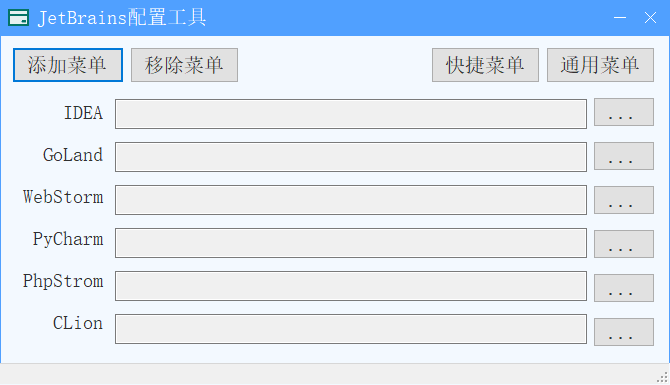

# JetBrains IDE菜单管理工具

有时候JetBrains打开项目方便，

## 功能描述

添加菜单

* 添加IDEA菜单
* 添加GoLand菜单
* 添加WebStrom菜单
* 添加PyCahrm菜单
* 添加PhpStorm菜单
* 添加CLion菜单

移除菜单

* 移除IDEA菜单
* 移除GoLand菜单
* 移除WenStorm菜单
* 移除PyCharm菜单
* 移除PhpStorm菜单
* 移除CLion菜单

## 项目预览

程序主页

## Futures

* 后期集成JetBrains全系列激活工具

* 后期添加VSCode、Visual Studio、HBuliderX菜单
* 后期添加JetBrains路径自动识别

